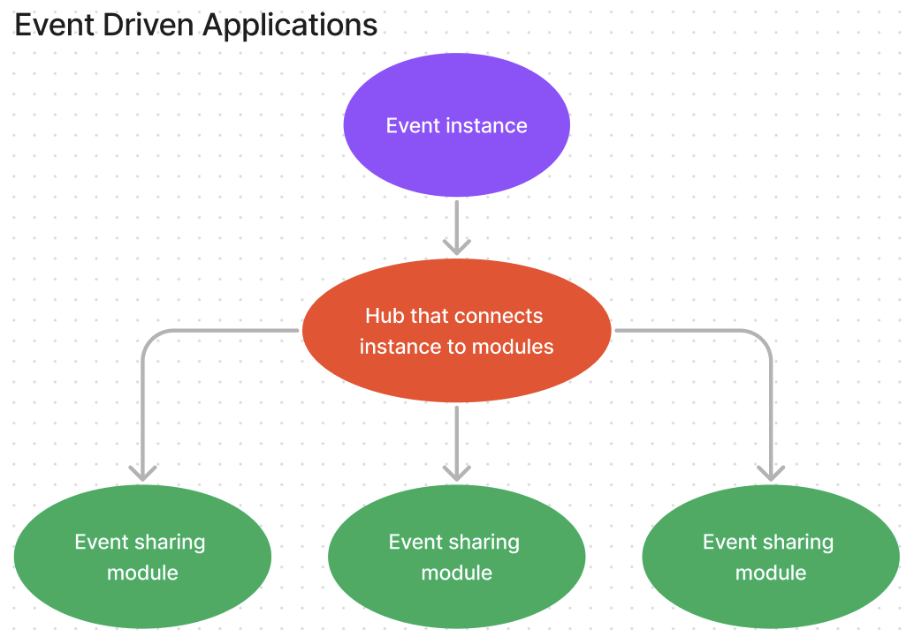

# CAPS - Code Academy Parcel Service

By: Rhett Beardemphl

## UML Diagram of Architecture

## Phase 1 User Stories

- As a vendor, I want to alert the system when I have a package to be picked up.
- As a driver, I want to be notified when there is a package to be delivered.
- As a driver, I want to alert the system when I have picked up a package and it is in transit.
- As a driver, I want to alert the system when a package has been delivered.
- As a vendor, I want to be notified when my package has been delivered.
- As a developer, I want to use industry standards for managing the state of each package.
- As a developer, I want to create an event driven system so that I can write code that happens in response to events, in real time.
